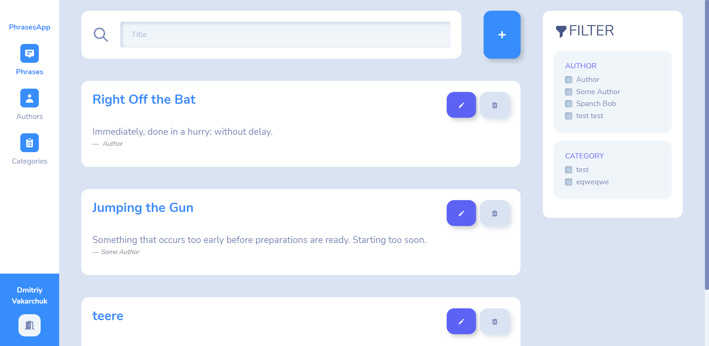
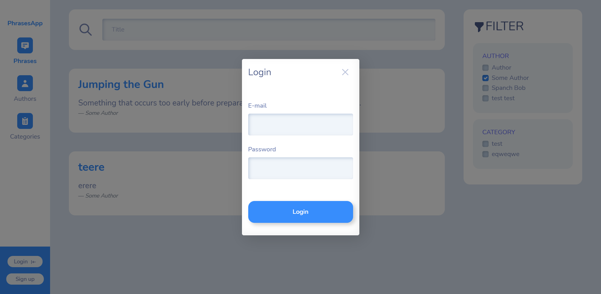
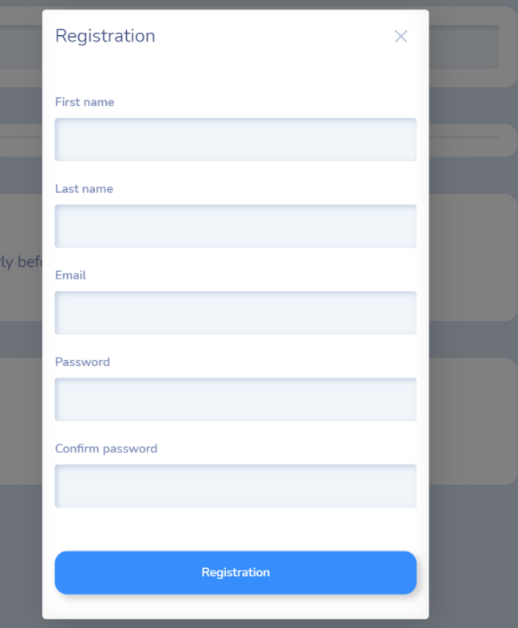

# Client application of catch-phrases
## Using dependencies
Libraries:
- MobX-react
- React-jwt
- js-cookie
- react-notifications-component
- React-bootstrap
- React-icons

Styles: 
- bootstrap
- bootstrap-minty

# Rendered components depending on the user role
User signed in as administrator

User signed in as a guest

## Modal 

